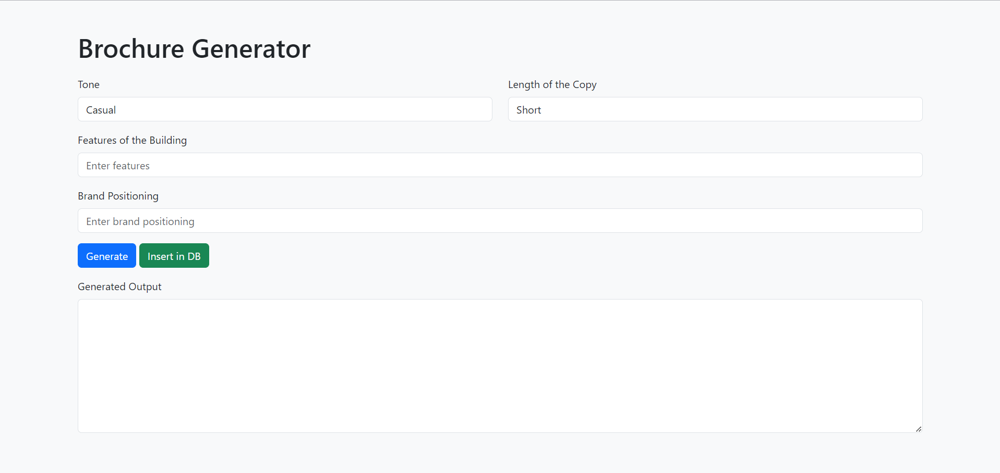

# Real Estate Brochure Generator

This project is a web application for generating and storing brochure for real estate properties. It includes a front-end built with React.js and a back-end built with Flask, which interacts with the Supabase database and an LLM text generation API.

## Repository
### [Frontend](https://github.com/its-kumar-yash/brochure-frontend)
### [Backend](https://github.com/its-kumar-yash/brochure-backend)


## Demo Video
### [Click Here](https://drive.google.com/file/d/1kO7I_1n_b-eyOzPvOB-55Q3RzlUbk45O/view?usp=sharing)


## Screenshots


## Tech Stack
- **Front-End:** React.js, CSS
- **Back-End:** Flask, Python
- **Database:** Supabase (PostgreSQL)
- **API:** Eden AI for text generation
- **Other Tools:** Axios, Requests, Supabase Python Client

## Installation and Setup

### Prerequisites
- Python 3.x
- Node.js and npm
- Supabase account
- Eden AI API key


### Backend Setup
1. Navigate to the backend directory:
```sh
cd backend
```
2. Create a virtual environment and activate it:
```sh
python -m venv venv
venv\Scripts\activate
```
3. Install the required packages:
```sh
pip install -r requirements.txt
```
4. Create a .env file in the backend directory and add your Supabase and Eden AI credentials:
```sh
REACT_APP_SUPABASE_URL=your_supabase_url
REACT_APP_SUPABASE_API_KEY=your_supabase_key
REACT_APP_EDEN_API_KEY=your_eden_ai_api_key
```
5. Run the Flask app:
```sh
python app.py
```

### Frontend Setup
1. Navigate to the frontend directory:
```sh
cd frontend
```
2. Install the required packages:
```sh
npm install
```
3. Start React Server
```sh
npm start
```

### Database Schema
| Column Name | Data Type | 
| ----------- | --------- |
| Positioning | text      |
| Features    | text      |
| Tone        | varchar   |
| Length      | varchar   |
| Output      | text      |

